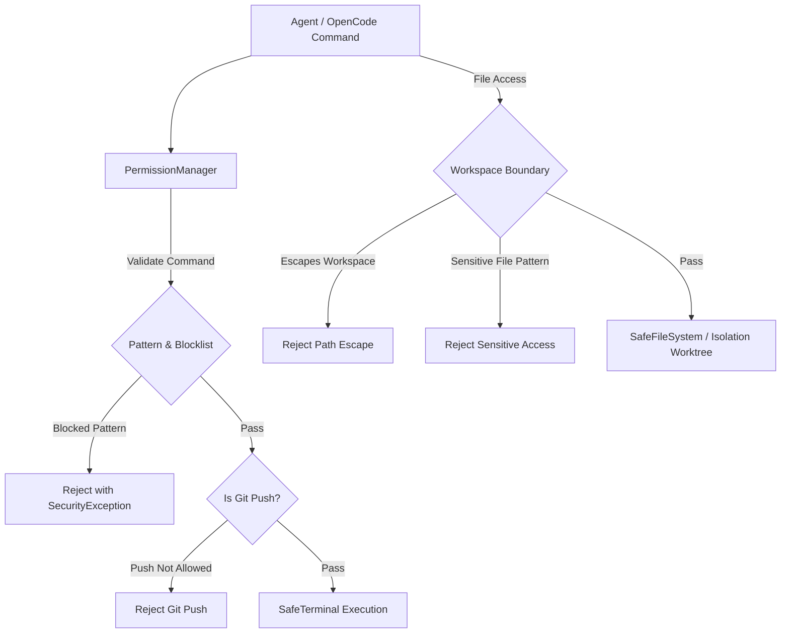

# Security Architecture and Permission Model

## 1. Overview

The **Adaptive Coding Agent Harness** provides security boundaries around autonomous agent execution. When an agent (OpenCode running on Gemini) executes within a project, it requires broad access to edit code and invoke tests. Unrestricted execution, however, poses significant risks to the host development environment, including data exfiltration, accidental deletion of host files, fork bombs, and unintended remote mutations (e.g. `git push`).

The harness introduces a multi-layer permission and security policy layer to constrain agent actions.

> [!WARNING]
> **Prototype Sandbox Notice**:
> The security controls implemented in this harness constitute an application-level guardrail and workspace confinement system designed for research and local developer evaluation. **This is not a kernel-enforced multi-tenant enterprise sandbox** (such as gVisor, Firecracker microVMs, or hardened seccomp/eBPF containers). For untrusted, hostile code execution in production, the harness must be run inside an isolated virtual machine or container sandbox.

---

## 2. Threat Model

The harness defends against three primary classes of security risks:

| Threat Category | Potential Impact | Harness Mitigation |
| :--- | :--- | :--- |
| **Workspace Escape & Path Traversal** | Agent reads or modifies files outside repository root (e.g., `~/.ssh`, `/etc/shadow`, AWS keys). | Strict path resolution and `relative_to` checks in `PermissionManager` and `SafeFileSystem`. |
| **Destructive Shell Commands** | Accidental or hallucinated commands (e.g., `rm -rf /`, `mkfs`, fork bombs, system shutdown). | Pre-execution AST/regex pattern matching and command blacklisting before shell dispatch. |
| **Unauthorized Remote Mutations** | Agent commits or pushes incomplete/compromised code to remote repositories. | `GitPermissions` disallows `git push` by default; prevents remote branch pollution. |

---

## 3. Security Layers



### 3.1. Command Validation & Pattern Blocking

Every shell invocation passes through `PermissionManager.validate_command()` before execution.

#### Prohibited Destructive Patterns
The harness blocks dangerous system-level and disk-altering patterns:
* `rm -rf /`, `rm -rf ~`, `rm -rf $HOME`, `rm -rf ../..`
* Filesystem creation: `mkfs`, `fdisk`
* Raw device access: `dd if=`, writes to `/dev/sd*`
* Fork bombs: `:(){ :|:& };:`
* Privilege alterations: `chmod -R 777 /`
* Pipe-to-shell downloads: `curl ... | bash`, `wget ... | sh`
* Administrative controls: `sudo`, `shutdown`, `reboot`, `poweroff`

#### Prohibited Git Remote Operations
* `git push` (and all variants `git push origin main`, `git push --force`) are strictly prohibited by default.
* Destructive repository operations: `git clean -fdx /` is blocked.
* Permitted Git operations include local inspections and branching: `git status`, `git diff`, `git log`, `git checkout -b`, `git add`, `git commit`.

### 3.2. Filesystem Confinement & Sensitive Path Protection

All file reads and writes are validated by `PermissionManager.validate_path()` and executed via `SafeFileSystem`:

1. **Workspace Confinement**:
   Target paths must resolve within `workspace.resolve()`. Any path attempting relative traversal (`../../`) or referencing absolute paths outside the workspace raises a `SecurityException`.

2. **Sensitive Path Blacklist**:
   Even if symlinked or referenced within workspace, the following paths are unconditionally blocked:
   * `/etc/shadow`, `/etc/passwd`
   * `~/.ssh/` (SSH private keys and known hosts)
   * `~/.aws/` (Cloud provider credentials)
   * `~/.gnupg/` (GPG keyrings)
   * `~/.gemini/` (API tokens and IDE credentials)

### 3.3. Git Worktree Isolation

During benchmark evaluations and multi-turn runs:
* The harness creates a clean temporary Git worktree under `.harness_worktrees/` or temporary directories.
* Evaluator modifications and agent code changes occur exclusively inside the isolated worktree.
* Once the benchmark task finishes, the worktree is inspected, diffs are recorded, and the worktree is cleanly pruned, leaving the master repository pristine.

---

## 4. Configuration Reference

Tool permissions are configurable in `harness.yaml` or via environment variables:

```yaml
permissions:
  filesystem:
    read: true
    write: true
  terminal:
    enabled: true
    blocked_commands:
      - "rm -rf /"
      - "rm -rf ~"
      - "mkfs"
      - "dd if="
      - ":(){ :|:& };:"
      - "chmod -R 777 /"
      - "git clean -fdx /"
      - "sudo"
      - "shutdown"
      - "reboot"
      - "poweroff"
  git:
    read: true
    write: false
    allow_commit: false
    allow_push: false
  tests:
    enabled: true
  linter:
    enabled: true
```

---

## 5. Explicit Security Verification

The security boundaries are continuously validated using the automated unit test suite in `tests/unit/test_security_explicit.py`, which covers:
* Workspace traversal attacks (`../` and out-of-boundary paths).
* 13 dangerous shell command patterns and system control commands.
* Git push variants and unauthorized remote mutations.
* Protection of 6 critical credential and OS paths.
* Safe developer command allowlisting (`pytest`, `ruff`, `npm test`).
* Granular configuration toggles (`filesystem.read/write`, `terminal.enabled`, `git.allow_push`).
